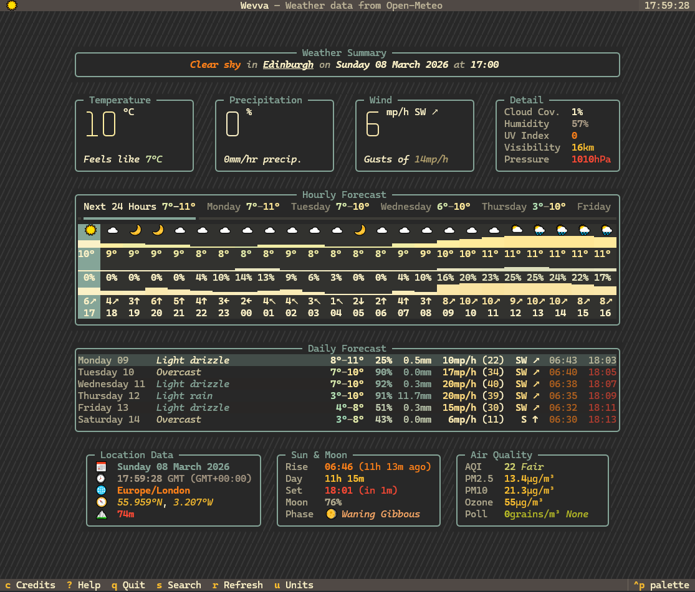

# wevva

`wevva` is a weather TUI built with [Textual](https://textual.textualize.io/) and powered by [Open-Meteo](https://open-meteo.com/).

<p align="center">
  
</p>

## Highlights

- Place search using Open-Meteo geocoding
- Current, hourly, and daily forecasts with detailed weather parameters and keyboard navigation
- Unit preferences (temperature, wind, precipitation)
- Theme and emoji toggles
- Interactive setup wizard for defaults
- Reusable Python API (async + sync helpers)

## Quick Start

First, install [uv](https://docs.astral.sh/uv/):

```bash
curl -Ls https://astral.sh/uv/install.sh | sh
```

Then, using `uvx` (`uv`'s command runner), run `wevva`:

```bash
uvx wevva
```

to launch the app without cloning the repo. This will install `wevva` as a package in a temporary environment and run it from there.

Alternatively, you can clone the repo and run from the local source:

```bash
uvx --from . wevva
```

Requires Python `>=3.12`.

## First-Time Setup

Run the setup wizard to save defaults:

```bash
uvx wevva setup
```

Save settings without launching:

```bash
uvx wevva setup --no-launch
```

## Useful Commands

```bash
# Start normally (uses saved defaults)
uvx wevva

# Start directly at a location
uvx wevva --location "Edinburgh"

# One-run overrides
uvx wevva --theme dracula --no-emoji
uvx wevva --temperature-unit fahrenheit --wind-speed-unit mph

# Manage saved default location
uvx wevva --set-default-location "New York"
uvx wevva --clear-default-location
```

## Library Usage

This library is designed to be used as a TUI, but I have also exposed a minimal set of functions for fetching weather data and geocoding that can be used in other Python contexts. These are available as both async and sync versions, depending on your needs.

Install as a package:

```bash
uv add wevva
```

Simple sync usage (nice for scripts):

```python
from wevva import forecast_by_place_sync

bundle = forecast_by_place_sync("Edinburgh")
print(bundle.metadata.name, bundle.metadata.country)
print(bundle.current.get_temperature(), bundle.current.forecast_units.get("temperature_2m"))
```

Async usage (best for apps/services):

```python
import asyncio
from wevva import forecast_by_coordinates

async def main() -> None:
    bundle = await forecast_by_coordinates(lat=55.9533, lon=-3.1883)
    print(bundle.daily.get_temperature_max(0))
    print(bundle.hourly.get_condition_abbreviation(0))

asyncio.run(main())
```

You can also geocode from Python:

```python
from wevva import geocode_sync

matches = geocode_sync("Glasgow", count=3)
for match in matches:
    print(match.name, match.country, match.latitude, match.longitude)
```

## In-App Keys

- `s` search for place
- `r` refresh weather
- `u` open unit settings
- `h` or `?` open help
- `c` credits
- `q` quit

## Config

Preferences are stored at:

```text
~/.config/wevva/config.json
```

Saved settings include:
- units
- theme
- emoji preference
- default location (and cached resolved location metadata)

## Notes

- Emoji rendering support varies by terminal/font/locale.
- TUI is the primary focus, but a lightweight Python API is now exported too.

## Known Issues

- Layout not super flexible, requires a terminal size of at least 100x43 for all elements to show fully.
- Temperature colour scaling is using the Met Office scale, the colours of which may not play nicely with all themes as they get towards the more extreme ends of the scale.
