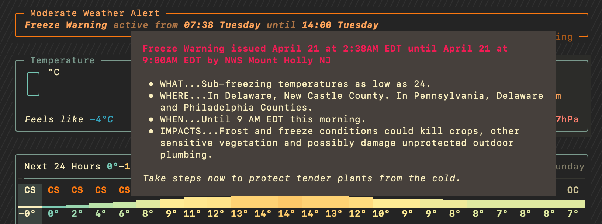

# wevva

`wevva` is a weather TUI built with [Textual](https://textual.textualize.io/) and powered by [Open-Meteo](https://open-meteo.com/).

<p align="center">
  
</p>

## Highlights

- Place search using Open-Meteo geocoding
- Current, hourly, and daily forecasts with detailed weather parameters and keyboard navigation
- Active weather alerts (normalized provider data)
- Unit preferences (temperature, wind, precipitation)
- Theme toggle and optional emoji rendering
- Interactive setup wizard for defaults
- Reusable Python API (async + sync helpers)

> [!NOTE]
> - Layout not super flexible, requires a terminal size of at least 100x43 for all elements to show fully.
> - Temperature colour scaling is using the Met Office scale, the colours of which may not play nicely with all themes as they get towards the more extreme ends of the scale.

## Quick Start

First, install [uv](https://docs.astral.sh/uv/):

```bash
curl -Ls https://astral.sh/uv/install.sh | sh
```

Then, using `uvx`, run `wevva`:

```bash
uvx wevva
```

to launch the app without cloning the repo. This will install `wevva` as a package in a temporary environment and run it from there.

Alternatively, you can clone the repo and run from the local source:

```bash
uvx --from . wevva
```

Requires Python `>=3.12`.

## First-Time Setup

> [!TIP]
> Run the setup wizard to save defaults:
>
> ```bash
> uvx wevva setup
> ```

Save settings without launching:

```bash
uvx wevva setup --no-launch
```

## Useful Commands

```bash
# Start normally (uses saved defaults)
uvx wevva

# Start directly at a location (picks first geocoding match, might not be what you expect!)
uvx wevva --location "Edinburgh"

# One-run overrides
uvx wevva --theme dracula --emoji
uvx wevva --temperature-unit fahrenheit --wind-speed-unit mph

# Manage saved default location
uvx wevva --set-default-location "New York"
uvx wevva --clear-default-location
```

> [!WARNING]
> - Emoji rendering support varies depending on terminal support and is disabled by default. Enable it with `--emoji` (or via `wevva setup`).
> - Colour support also varies. Try `export COLORTERM=truecolor` if colours display strangely.

## Weather Alerts

<p align="center">
  
</p>

- Weather alerts are using my [`wevva-warnings`](https://github.com/njf0/wevva-warnings) library.
  - Because we fetch all alerts for the searched location's country, then filter them by the forecast location coordinates, this may take a minute or two if there are many active alerts in the country.
- Where a provider includes an official alert URL, `wevva` shows it directly on the alert card so you can jump out to the source document.
- We use the latitude and longitude coordinates of the forecast location in combination with the warning provider-issued polygon data. Some countries/providers don't issue polygon data, so we are unable to show alerts for those locations.

> [!TIP]
> Hover over the alert to show a tooltip with the full warning description from the provider.

## Library Usage

This library is designed to be used as a TUI, but I have also exposed a minimal set of functions for fetching weather data and geocoding that can be used in other Python contexts. These are available as both async and sync versions, depending on your needs.

Install as a package:

```bash
uv add wevva
```

Simple sync usage (nice for scripts):

```python
from wevva import forecast_by_place_sync

bundle = forecast_by_place_sync("Edinburgh")
print(bundle.metadata.name, bundle.metadata.country)
print(bundle.current.get_temperature(), bundle.current.forecast_units.get("temperature_2m"))
```

Async usage (best for apps/services):

```python
import asyncio
from wevva import forecast_by_coordinates

async def main() -> None:
    bundle = await forecast_by_coordinates(lat=55.9533, lon=-3.1883)
    print(bundle.daily.get_temperature_max(0))
    print(bundle.hourly.get_condition_abbreviation(0))

asyncio.run(main())
```

You can also geocode from Python:

```python
from wevva import geocode_sync

matches = geocode_sync("Glasgow", count=3)
for match in matches:
    print(match.name, match.country, match.latitude, match.longitude)
```

Fetch alerts by coordinates:

```python
from wevva import alerts_by_coordinates_sync

alerts = alerts_by_coordinates_sync(lat=39.7456, lon=-97.0892, country_code="US")
for alert in alerts:
    print(alert.event, alert.severity, alert.expires)
```

## In-App Keys

- `s` search for place
- `r` refresh weather
- `u` open unit settings
- `h` or `?` open help
- `c` credits
- `q` quit

## Config

Preferences are stored at:

```text
~/.config/wevva/config.json
```

Saved settings include:
- units
- theme
- emoji preference
- default location (and cached resolved location metadata)
